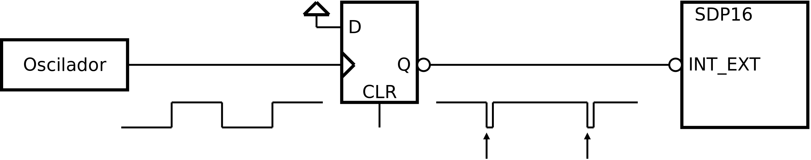

.. _interrupts_exemplo1:

Relógio de sistema
******************

O relógio de sistema (*system clock*) é um recurso quase sempre necessário e
também disponível num sistema computacional.
Esse relógio assume normalmente a forma de um contador que incrementa ou decrementa
monotonamente com a passagem do tempo, a um ritmo definido.
Os programas de aplicação podem basear-se nesse contador para realizar temporizações.
O contador pode concretizar-se como um contador *hardware*, uma variável em memória
ou uma combinação de ambos.

Neste exemplo realiza-se um relógio de sistema no SDP16, baseado numa variável em memória.
O incremento dessa variável é realizado numa rotina de atendimento de interrupção
-- ISR, do inglês *Interrupt Service Rotine* -- que é invocada por acção de um sinal de relógio,
aplicado à entrada de interrupção do processador.

Para teste é utilizado um programa que faz piscar um LED ligado
num *bit* do porto de saída, a um dado ritmo.

Se se aplicasse directamente o sinal de relógio à entrada de interrupção (:numref:`p16_osc_irq`),
o pedido de interrupção estaria activo enquanto o sinal estivesse a zero
-- a entrada de interrupção é ativa a zero.
Para um sinal de 100 Hz (valor comumente usado), com *dutty cycle* de 50 %,
essa duração corresponde a 5 ms. Durante este período a ISR seria executada várias vezes,
quando o que se pretende é executá-la apenas uma vez, em cada ciclo do relógio.

.. figure:: p16_osc_irq.png
   :name: p16_osc_irq
   :align: center

   Saída do oscilador aplicada diretamente à entrada de interrupção

Uma solução possível consiste em intercalar um *flip-flop*,
sensível à transição, entre o sinal de relógio
e a entrada de interrupção (:numref:`p16_osc_flip_irq`).
O que permite controlar o pedido de interrupção, retirando-o após a primeira aceitação
-- acção CLR sobre o *flip-flop* -- e deixar o *flip-flop* receptivo a nova transição
e consequentemente a gerar novo pedido de interrupção, apenas num novo ciclo de relógio.

   Saída do oscilador aplicada à entrada de interrupção através de *flip-flop*

Como realizar a eliminação do pedido de interrupção (acção CLR sobre o flip-flop)?

Neste exemplo tira-se partido dos sinais de *status* S0 e S1 disponíveis no P16
(:numref:`p16_osc_flip_clr_s0s1_irq`).
Este sinais são ambos colocados a um durante o atendimento de uma interrupção.
Este método tem a vantagem de realizar automaticamente a acção CLR do *flip-flop*.
Não sendo necessário realizar nenhuma operação explícita.

.. figure:: p16_osc_flip_clr_s0s1_irq.png
   :name: p16_osc_flip_clr_s0s1_irq
   :align: center

   Eliminação do pedido de interrupção utilizando os sinais de *status* S0 e S1

Na :numref:`system_clock` apresenta-se uma solução de programação em linguagem C.
O relógio de sistema é concretizado na variável ``system_clock``.
Esta variável é incrementada na ISR em cada invocação dessa função (linha 19).
No programa principal, é utilizada como referência temporal
-- como o contador de um *timer*.
Na linha 12 é tomado o seu valor, na variável ``initial``, e durante o *while*,
na linha 13, é continuamente calculada a diferença entre o seu valor actual
e o valor em ``initial``. Nas primeiras iterações não haverá diferença,
mas à medida que o tempo passa, e as interrupções se sucedem,
o valor de ``system_clock`` aumenta e a diferença também aumenta,
até atingir o valor ``HALF_PERIOD``.
A função auxiliar ``interrupt_enable`` coloca a flag I a um,
para tornar o processador receptivo a interrupções.
A função auxiliar ``irequest_clear`` elimina o pedido de interrupção no *flip-flop*.

.. code-block:: c
   :linenos:
   :caption: Implementação de relógio de sistema por *software*
   :name: system_clock

   #define LED_MASK 1

   #define HALF_PERIOD 50

   volatile uint16_t system_clock;

   void main() {
   	uint8_t led_state = ~0;
   	interrupt_enable();
   	while (1) {
   		port_output(led_state & LED_MASK);
   		uint16_t initial = system_clock;
   		while (system_clock - initial < HALF_PERIOD)
   			;
   		led_state = ~led_state;
   	}
   }

   void isr() {
   	system_clock++;
   }

Programação em *Assembly*
#########################

Na programação em linguagem *assembly*,
poderão observar-se os detalhes de implementação ao nível do processador.

Na :numref:`startup` apresenta-se o código de arranque do programa,
adequado à utilização do mecanismo de interrupção.
Ao aceitar a interrupção, o processador simula a execução de uma
instrução ``bl`` (*branch whith link*) para o endereço ``0x0002``.
Esse endereço deve conter código que conduza à ISR.
Na :numref:`startup`, esse código corresponde a ``ldr pc, addressof_isr`` (linha 3)
que carrega em PC o endereço de ``isr``, provocando a passagem da execução para a ISR.

.. code-block:: asm
   :linenos:
   :caption: Código de arranque adequado ao atendimento de interrupções
   :name: startup

   	.section .startup
   	b	_start
   	ldr	pc, addressof_isr
   _start:
   	ldr	sp, addressof_stack_top
   	ldr	r0, addressof_main
   	mov	r1, pc
   	add	lr, r1, 4
   	mov	pc, r0
   	b	.
   addressof_stack_top:
   	.word	stack_top
   addressof_main:
   	.word	main
   addressof_isr:
   	.word	isr

   	.text

   	.data

   	.section .stack
   	.equ	STACK_SIZE, 1024
   	.space	STACK_SIZE
   stack_top:

O acesso às flags do processador, entre elas a *flag* I, é realizado pelas instruções
``msr`` e ``mrs``.

.. code-block:: asm
   :linenos:
   :caption: Código *Assembly* equivalente à função ``interrupt_enable``
   :name: interrupt_enable

   	.equ	IFLAG_MASK, (1 << 4)

   	mov	r0, IFLAG_MASK
   	msr	cpsr, r0

A instrução ``msr cpsr, r0`` coloca a *flags* **I** a um,
permitindo ao processador passar a aceitar interrupções.
O símbolo IFLAG_MASK é equivalente a um valor com o *bit* da posição quatro a um,
que corresponde à posição da *flag* **I** nos registos CPSR e SPSR.

O atendimento de uma interrupção dá-se depois do processamento de uma qualquer instrução
e antes da execução da instrução seguinte,
sem que o programador controle o local do programa em que ocorre.
Neste programa ocorre na função ``main``, durante a execução do ciclo ``while (1)``,
entre as linhas 6 e 19.

.. code-block:: asm
   :linenos:
   :caption: Programa principal em *Assembly*
   :name: main_asm

   main:
   	mov	r4, 0				; uint8_t led_state = 0
   	mov	r0, IFLAG_MASK			; interrupt_enable();
   	msr	cpsr, r0
   while:               			; while (1) {
   	mov	r0, LED_MASK
   	and	r0, r0, r4
   	bl 	port_output			; port_output(led_state & LED_MASK);
   	ldr	r1, addressof_system_clock
   	ldrb	r5, [r1]			; uint16_t initial = system_clock;
   while1:              			; while (
   	ldr	r0, [r1]			;	system_clock - initial
   	sub	r0, r0, r5
   	mov	r2, HALF_PERIOD & 0xff		;	< HALF_PERIOD)
   	mov	r2, HALF_PERIOD >> 8
   	cmp	r0, r2
   	blo	while1
   	mvn	r4, r4				; led_state = ~led_state;
   	b	while

Na altura em que o programa é interrompido, os registos do processador contêm dados
que não podem ser corrompidos.
Assim, o processo de atendimento de interrupção deve garantir que nenhum registo
se apresenta alterado depois de ter ocorrido uma interrupção.

Os registos LR e CPSR são preservados pelo processador,
por ação da mudança de modo, de "modo normal" para "modo interrupção".
Os restantes registos ficam a cargo do programador ao definir o código da ISR.
O critério é garantir que o conteúdo de todos os registos utilizados é salvaguardado.
Na :numref:`isr_asm` são utilizados apenas os registos R0 e R1.
Os seu conteúdo prévio é salvo em *stack* à entrada na função (linhas 4 e 5)
e é reposto à saída (linhas 16 e 17).
O retorno ao programa interrompido é efetivado pela instrução ``movs pc, lr`` (linha 18).
Esta instrução, além de colocar o conteúdo de LR em PC,
e assim retornar ao local onde o programa tinha sido interrompido,
também comuta o processador de "modo interrupção" para "modo normal",
restaurando assim, os conteúdos prévios dos registos CPSR e LR
-- CPSR por cópia de SPSR e LR por alteração da visibilidade das duas instâncias deste registo.

.. code-block:: asm
   :linenos:
   :caption: *Interrupt Service Rotine*
   :name: isr_asm

   	.text
   isr:
   	push	r0
   	push	r1

   	ldr	r1,addressof_system_clock		; system_clock++;
   	ldr	r0,[r1]
   	add	r0,r0, 1
   	str	r0,[r1]

   	pop	r1
   	pop	r0
   	movs	pc, lr

**Código completo:** :download:`system_clock.s<../code/system_clock.s>`

**Logisim:**
   - Cicuito: :download:`sdp16_system_clock.circ<../logisim/sdp16_system_clock.circ>`
   - *Screenshot*: :download:`Screenshot_Logisim<../logisim/Screenshot_Logisim.png>`
   - Compilação:

   .. code-block:: console

      pas system_clock.s -f logisim -l 2

**Exercício:**

1. (a definir)
