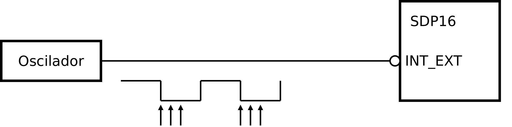
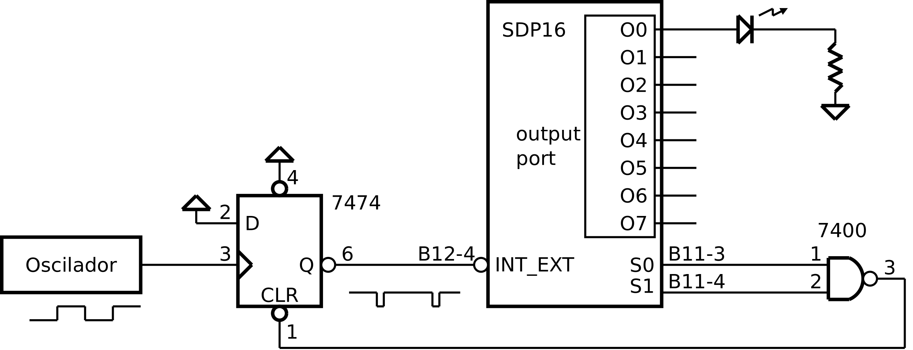

.. _interrupts_exemplo1:

Relógio de sistema
******************

O relógio de sistema (*system clock*) é um recurso quase sempre necessário e
também disponível num sistema computacional.
Esse relógio assume normalmente a forma de um contador que incrementa ou decrementa
monotonamente com a passagem do tempo a um ritmo definido.
Os programas de aplicação podem basear-se nesse contador para realizar temporizações.
O contador pode concretizar-se como um contador *hardware*, uma variável em memória
ou uma combinação de ambos.

Neste exemplo realiza-se um relógio de sistema no SDP16, baseado numa variável em memória.
Essa variável é incrementada na rotina de atendimento de interrupção
-- ISR (*Interrupt Service Rotine*) -- que é invocada por ação de um sinal de relógio,
aplicado à entrada de interrupção do processador.

Para teste do relógio de sistema, utiliza-se um programa que faz piscar um LED
ligado no porto de saída.

Se se aplicasse directamente o sinal de relógio à entrada de interrupção (:numref:`p16_osc_irq`),
o pedido de interrupção estaria activo enquanto o sinal estivesse a **0**
(a entrada de interrupção é ativa a **0**).
Para um sinal de 100 Hz (valor comummente usado), com *dutty cycle* de 50 %,
essa duração é de 5 ms. Durante este período a ISR seria executada várias vezes,
quando o que se pretende é executá-la apenas uma vez, em cada ciclo do relógio.

   Saída do oscilador aplicada diretamente à entrada de interrupção

Uma solução possível consiste em intercalar um *flip-flop*,
sensível à transição, entre o sinal de relógio
e a entrada de interrupção (:numref:`p16_osc_flip_irq`).
Isso permite controlar o pedido de interrupção, retirando-o após a primeira aceitação
-- acção CLR sobre o *flip-flop* -- e deixar o *flip-flop* receptivo a nova transição
e consequentemente a gerar novo pedido de interrupção, apenas num novo ciclo de relógio.

.. figure:: p16_osc_flip_irq.png
   :name: p16_osc_flip_irq
   :align: center
   :scale: 25%

   Saída do oscilador aplicada à entrada de interrupção através de *flip-flop*

Como realizar a eliminação do pedido de interrupção (acção CLR sobre o flip-flop)?

Neste exemplo tira-se partido dos sinais de *status* S0 e S1 disponíveis no P16
(:numref:`p16_osc_flip_clr_s0s1_irq`).
Este sinais são ambos colocados a **1** no atendimento de uma interrupção.
Este método tem a vantagem de realizar automaticamente a acção CLR do *flip-flop*,
não sendo necessário programar uma ação explícita.

      
   Eliminação do pedido de interrupção utilizando os sinais de *status* S0 e S1

Na :numref:`system_clock` apresenta-se uma solução de programação em linguagem C.
O relógio de sistema é concretizado na variável ``system_clock``.
Esta variável é incrementada na ISR (linha 20).
No programa principal, é utilizada como referência temporal
-- como o contador de um *timer*.
Na linha 12 é tomado o seu valor, na variável ``initial``, e durante o *while*,
na linha 13, é continuamente calculada a diferença entre o seu valor actual
e o valor em ``initial``. Nas primeiras iterações não haverá diferença,
mas à medida que o tempo passa, e as interrupções se sucedem,
o valor de ``system_clock`` aumenta e a diferença também aumenta,
até atingir o valor ``HALF_PERIOD``.
A função auxiliar ``interrupt_enable`` coloca a flag I a **1**,
para tornar o processador receptivo a interrupções.

.. literalinclude:: ../code/system_clock.s
   :language: c
   :linenos:
   :caption: Implementação de relógio de sistema por *software*
   :name: system_clock
   :lines: 32-52

Em linguagem C, o qualificador ``volatile`` indica ao compilador que o conteúdo
dessa variável pode alterar-se de maneira desconhecida.

Por otimização na tradução para linguagem *assembly*,
o compilador pode omitir acessos à memória para leitura de variáveis
que saiba não terem sido alteradas.
Como pode ser o caso de ``initial`` na expressão da condição do *while* da linha 13.

O compilador realiza sempre acesso de leitura das variáveis com qualificador ``volatile``
quando são invocadas. Como é o caso de ``system_clock``,
na expressão do *while* da linha 13.

Efetivamente o conteúdo desta variável é alterado
durante o processamento do *while* da linha 13, por ação da ISR.

Programação em *Assembly*
#########################

Em linguagem *assembly*, poderão observar-se os detalhes de programação
relacionados com o mecanismo de interrupção.

Na :numref:`startup` apresenta-se o código de arranque do programa,
adequado à utilização do mecanismo de interrupção.
Ao aceitar a interrupção, o processador simula a execução de uma
instrução ``bl`` (*branch whith link*) para o endereço ``0x0002``.
Esse endereço deve conter o código da ISR ou código que conduza à ISR.
Na :numref:`startup`, esse código corresponde a ``ldr pc, addressof_isr`` (linha 3)
que carrega em PC o endereço de ``isr``, provocando a passagem da execução para a ISR,
alojada noutro local.

.. literalinclude:: ../code/system_clock.s
   :language: c
   :linenos:
   :caption: Código de arranque adequado ao atendimento de interrupções
   :name: startup
   :lines: 1-25

O acesso às flags do processador, entre elas a *flag* I, é realizado pelas instruções
``msr`` e ``mrs``.

.. literalinclude:: ../code/system_clock.s
   :language: asm
   :linenos:
   :caption: Código *Assembly* equivalente à função ``interrupt_enable``
   :name: interrupt_enable
   :lines: 27-28, 67-70

A instrução ``msr cpsr, r0`` coloca a *flag* I a **1**,
permitindo ao processador aceitar interrupções.
O símbolo IFLAG_MASK é equivalente a um valor com **1** no *bit* da posição quatro,
que corresponde à posição da *flag* I nos registos CPSR e SPSR.

O atendimento de uma interrupção dá-se depois do processamento de uma qualquer instrução
e antes da execução da instrução seguinte,
sem que o programador controle o local do programa em que ocorre.
Neste programa, ocorre seguramente na função ``main``,
durante a execução do ciclo ``while (1)``,
entre as linhas 6 e 19.

.. literalinclude:: ../code/system_clock.s
   :language: asm
   :linenos:
   :caption: Programa principal em *Assembly*
   :name: main_asm
   :lines: 71-85

Na altura em que o programa é interrompido, qualquer registo do processador contêm dados
que não podem ser corrompidos.
Assim, deve-se garantir que nenhum registo se apresenta alterado depois de concluido
o processo de atendimento de interrupção. Esse requisito é cumprido conjugando
ações específicas do processador e do programador.

Na transição de "modo normal" para "modo de interrupção",
os registos LR e CPSR são preservados por ação do processador.
Os restantes registos ficam a cargo do programador, com código a executar na ISR.
O compromisso é garantir que o conteúdo de todos os registos utilizados é salvaguardado.
Na :numref:`isr_asm` são utilizados apenas os registos R0 e R1.
O seu conteúdo prévio é salvo em *stack* à entrada na função (linhas 3 e 4)
e é reposto à saída (linhas 11 e 12).
O retorno ao programa interrompido é efetivado pela instrução ``movs pc, lr`` (linha 13).
Esta instrução, além de colocar o conteúdo de LR em PC,
e assim retornar ao local onde o programa tinha sido interrompido,
também comuta o processador de "modo interrupção" para "modo normal",
restaurando assim, os conteúdos prévios dos registos CPSR e LR
-- CPSR por cópia de SPSR e LR por alteração da visibilidade das duas instâncias deste registo.

.. literalinclude:: ../code/system_clock.s
   :language: asm
   :linenos:
   :caption: *Interrupt Service Rotine*
   :name: isr_asm
   :lines: 89-104

**Código completo:** :download:`system_clock.s<../code/system_clock.s>`

**Logisim:**
   - Cicuito: :download:`sdp16_system_clock.circ<../logisim/sdp16_system_clock.circ>`
   - *Screenshot*: :download:`Screenshot_Logisim<../logisim/Screenshot_Logisim.png>`
   - Compilação: ``p16as system_clock.s -f logisim -l 2``

**Exercício:**

1. Altere a programação da ISR admitindo que
o circuito de eliminação do pedido de interrupção é como o da (:numref:`p16_osc_flip_clr_irq`). 
