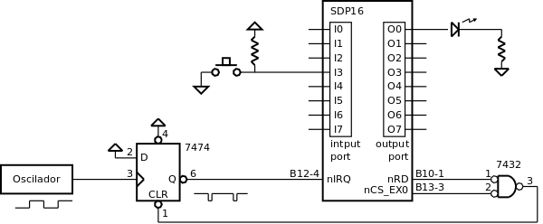

.. _interrupts_exemplo2:

Pisca-pisca com botão
*********************

Neste exemplo realiza-se o controlo de intermitência de um LED com um botão de pressão,
com uma aprência igual à do exemplo da :numref:`Timers_exemplo3`,
mas utilizando o mecanismo de interrupções do P16 para realizar a intermitência do LED.

A solução proposta consiste em utilizar um sinal de relógio para gerar interrupção
e provocar a execução periódica da ISR.

Por exemplo, se se pretender que a intermitência tenha o ritmo de um segundo
-- meio segundo aceso e meio segundo apagado --
e se a ISR inverter o estado do LED em cada execução,
o sinal de relógio deve ter uma frequência de 2Hz.

   Eliminação do pedido de interrupção utilizando a interface de memória

A ação de eliminação do pedido de interrupção utiliza a interface de acesso à memória.
O sinal CLR do *flip-flop* é ativado num acesso de leitura ao endereço 0xFF40
(:numref:`p16_osc_flip_clr_irq`). (No SDP16, endereçar a 0xFF40 ativa o sinal nCS_EX0.)
Esta ação deve ser realizada no interior da ISR.

Na :numref:`blink_intr` apresenta-se uma solução de programação em linguagem C.
O estado do programa é baseado em duas variáveis:
``blink_state``, que representa o estado de intermitência do LED
-- intermitência activa ou intermitência inactiva
-- e ``led_state``, que representa o estado instantâneo do LED
-- apagado ou aceso.
O programa principal, entre as linhas 11 e 14,
monitoriza a pressão do botão e age sobre a variável `blink_state`.
A ISR, em função da variável de estado blink_state,
inverte o estado do LED e actualiza a sua visualização no porto de saída.
A função auxiliar ``irequest_clear`` elimina o pedido de interrupção no *flip-flop*.

.. code-block:: c
   :linenos:
   :caption: Controlo de intermitência de um LED
   :name: blink_intr

   #define	LED_MASK	(1 << 0)
   #define	BUTTON_MASK	(1 << 3)

   int blink_state;
   int led_state;

   void main() {
   	interrupt_enable():
   	port_output(led_state | LED_MASK);
   	while (1) {
   		while ((port_input() & BUTTON_MASK) == 0)
   			;
   		blink_state = !blink_state;
   		while ((port_input() & BUTTON_MASK) != 0)
   			;
   	}
   }

   void isr() {
   	if (blink_state)
   		led_state = ~led_state;
   	else
   		led_state = 0;
   	port_output(led_state  & LED_MASK);
   	irequest_clear();
   }

Programação em Assembly
#######################

Neste exemplo o aspeto relevante a assinalar é a invocação da função ``port_output``
na ISR.

Quando se invoca uma função não se deve aplicar eventual conhecimento
sobre a implementação dessa função,
mas sim assumir os protocolos convencionados
sobre a passagem de parâmetros e a presevação de registos.
Segundo as convenções,
uma função pode utilizar os registos R0, R1, R2 e R3 sem os preservar.

Isso justifica que apesar dos registos R2 e R3 não estarem a ser utilizados na ISR
sejam preservados nesta rotina (linhas 5,6, 30 e 31). À entrada na ISR estes registos
contêm dados do programa interrompido. A forma de garantir que não são alterados
é salva-los antes de invocar outras funções.

Os registos a partir de R4 também contêm dados do programa interrompido.
No entanto só é necessário proceder a ações de preservação se forem utilizados na própria ISR.
No que respeita a invocação de outras funções, não é necessário fazer nada.
Segundo o protocolo, elas próprias se encarregarão de preservar estes registos.

O registo LR tem que ser preservado porque a utilização da instrução BL altera o
seu conteúdo. À entrada da ISR ele contém o endereço de retorno para o programa
interrompido.

.. code-block:: asm
   :linenos:
   :caption: *Interrupt Service Rotine*
   :name: isr

   	.equ IREQUEST_CLEAR_ADDRESS, 0xff40
   isr:
   	push	r0
   	push	r1
   	push	r2
   	push	r3
   	push	lr

   	ldr	r1, addressof_blink_state	; if (blink_state)
   	ldrb	r0, [r1]
   	ldr	r1, addressof_led_state
   	add	r0, r0, 0
   	beq	isr_if_else
   	ldrb	r0, [r1]			; led_state = !led_state;
   	mvn	r0, r0
   	b	isr_if_end
   isr_if_else:
   	mov	r0, 0				; led_state = 0;
   isr_if_end:
   	strb	r0, [r1]
   	mov	r1, LED_MASK			; port_output(led_state  & LED_MASK);
   	and	r0, r0, r1
   	bl	port_output

   	mov	r0, IREQUEST_CLEAR_ADDRESS & 0xff	; ativação da entrada CLR do flip-flop
   	movt	r0, IREQUEST_CLEAR_ADDRESS >> 8
   	ldr	r0, [r0]

   	pop	lr
   	pop	r3
   	pop	r2
   	pop	r1
   	pop	r0
   	movs	pc, lr

A operação de eliminação do pedido de interrupção, representada pela função ``irequest_clear``,
é realizada nas linhas 25 a 27. Começa-se por carregar em R0 o endereço 0xFF40
e em seguida a execução da instrução ``ldr r0, [r0]``
provoca a ativação simultânea dos sinais nCS_EX0 e nRD.
O local no código da ISR onde esta operação é realizada é indiferente,
porque toda a rotina é executada com o processador em estado de não
aceitação de interrupções -- *flag* I a zero.

**Código completo:** :download:`blink_intr.s<../code/blink_intr.s>`

**Logisim:**
   - Cicuito: :download:`sdp16_blink_intr.circ<../logisim/sdp16_blink_intr.circ>`
   - *Screenshot*: :download:`Screenshot_Logisim<../logisim/Screenshot_Logisim.png>`
   - Compilação:

   .. code-block:: console

      pas blink_intr.s -f logisim -l 2

**Exercício:**

1. (a definir)

