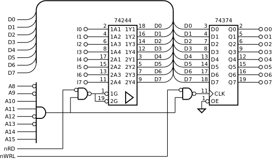

.. _Portos_exemplo1:

Transparente
************

Neste exemplo são utilizados um porto de entrada e um porto de saída,
ambos de 8 *bits*, representados na :numref:`p16_input_output_port`.
Como estão ligados na parte baixa do barramento de dados (D0-D7),
ambos os portos são acessíveis com endereços pares.
A seleção destes portos depende dos sinal A8 a A15,
situando-os na gama de endereços entre `0xcc00` e `0xccff`.

   Porto de entrada e porto de saída de 8 *bits*

O programa principal (:numref:`in_out`) recolhe os dados presentes no porto de entrada
(linha 8) e em seguida escreve-os no porto de saída (linha 9).
Esta sequência é executada continuamente, criando a aparência
de que o porto de saída está ligado diretamente ao porto de entrada.

.. literalinclude:: ../code/in_out.s
   :language: asm
   :linenos:
   :caption: Programa principal
   :name: in_out
   :lines: 34-43

A sequência de instruções

.. literalinclude:: ../code/in_out.s
   :language: asm
   :lines: 38-39

carrega o endereço do porto, representado por ``PORT_ADDRESS``
e cujo valor é ``0xcc00``, no registo R1.

Esta sequência constitui um padrão de programação para
carregamento em registo de qualquer valor numérico representado a 16 *bits*.
Este valor numérico deve ser o resultado de uma expressão, determinável em
tempo de compilação (que não dependa de uma *label*).

A expressão ``PORT_ADDRESS & 0xff`` é usada para garantir que o valor do segundo
parâmetro da instrução ``mov`` é inferior a 0x100
(corresponde à gama de valores codifiáveis na instrução ``mov``).

A expressão ``PORT_ADDRESS >> 8`` é usada para extrair a componente de maior peso
do endereço do porto. Se o endereços for inferior a 0x100 o valor desta expressão é zero.

A instrução ``ldrb r0,[r1]`` recolhe os dados presentes no porto de entrada
para a parte baixa do registo R0.
Na fase de execução desta instrução, o processador coloca o endereço ``0xcc00``
no barramento de endereços (A0-15) e ativa o sinal nRD.
Em consequência o *buffer tri-state* (:numref:`p16_input_output_port`)
transfere os dados presentes nas entradas I0-7
para a parte baixa do barramento de dados (D0-7).
Por sua vez, o processador encaminha esses dados para o registo R0.

A instrução ``strb r0,[r1]`` copia os dados presentes na parte baixa de R0
para o porto de saída.
Ao executar esta instrução, o processador coloca
o endereço ``0xcc00`` no barramento de endereços (A0-15) e ativa o sinal nWRL.
Esta configuração coloca a zero a entrada CLK do registo (pino 11)
(:numref:`p16_input_output_port`).
A desativação do sinal nWRL provoca uma transição ascendente
no sinal CLK do registo
que promove a retenção os dados presentes na parte baixa do barramento de dados (D0-7).
Estes dados correspondem à parte baixa de R0.

**Código fonte:** :download:`in_out.s<../code/in_out.s>`

**Teste em Logisim:**
   - Cicuito: :download:`p16_input_output_port.circ<../logisim/p16_input_output_port.circ>`
   - *Screenshot*: :download:`Screenshot_Logisim<../logisim/Screenshot_Logisim.png>`
   - Compilação:

   .. code-block:: console

      p16as in_out.s -f logisim -l 2

**Teste no P16 Simulator:**
   - Ficheiro de configuração do p16sim: :download:`p16sim_config_ports_ex1.txt<../p16sim/p16sim_config_ports_ex1.txt>`
   - Compilação do programa:

   .. code-block:: console

      p16as in_out.s

   - Invocação do simulador:

   .. code-block:: console

      p16sim -c p16sim_config_ports_ex1.txt
   
**Exercícios:**

1. Testar este programa no SDP16, utilizando os portos internos.
