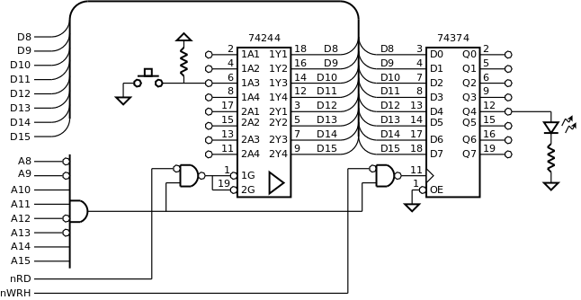

.. _Portos_exemplo2:

LED on/off
**********

Neste exemplo, reproduz-se no LED o estado do botão de pressão:
se o botão estiver solto o LED está apagado;
se o botão estiver premido o LED está aceso.

São utilizados o porto de entrada e o porto de saída de 8 *bits* apresentados
na :numref:`p16_button_led`.
Note-se que os portos estão ligados na parte alta do barramento de dados (D8-15).

   Portos de 8 *bits* na parte alta do *data bus*

O programa da :numref:`led_button` lê continuamente o porto de entrada -- ``inport_read()`` --
e testa o *bit* da posição do botão.
Se o valor lógico desse *bit* for **0**, significa que o botão está premido,
então escreve no porto de saída um valor com **1** no *bit* da posição do LED,
para acender o LED -- ``outport_write(LED_MASK)``.
Se o valor lógico do *bit* do botão for **1**, significa que o botão está solto,
então escreve o valor **0** para apagar o LED -- ``outport_write(0)``.

Os símbolos BUTTON_MASK e LED_MASK representam valores com 0
em todas as posições, exceto nas posições onde o botão ou o LED estão ligados
-- linhas 1 e 2 da :numref:`led_button`.
(Estes valores designam-se genericamente por máscaras.)
Por exemplo, o símbolo ``BUTTON_MASK``,
definido pela expressão (1 << 2), é equivalente a ``0000 0100``,
o **1** está na mesma posição em que o botão está ligado no porto de entrada.

O teste do estado do botão recorre à utilização da operação *and bit-a-bit*
-- ``& BUTTON_MASK``. Os *bits* a 0 na máscara (elemento absorvente da operação *and*)
garantem que o resultado é 0 nessas posições.
Nas outras posições o resultado depende do valor em teste,
já que nessas posições a máscara tem 1 (elemento neutro da operação *and*).
Se o resultado da operação *and bit-a-bit* for zero significa que o *bit* em teste é 0.
Se este *bit* for 1 o resultado será diferente de zero.

A utilização destes símbolos facilita a interpretação do programa
e a adaptação do mesmo a situações diferentes. Se por exemplo,
a ligação do botão for mudada para outra posição,
a adaptação do programa consiste apenas em alterar a definição de ``BUTTON_MASK``.

.. literalinclude:: ../code/led_button.s
   :language: c
   :linenos:
   :caption: Programa principal em linguagem C
   :name: led_button
   :lines: 22-32

Na tradução do programa para linguagem *assembly* (:numref:`led_button_asm`),
as funções ``inport_read`` e ``outport_write`` são traduzidas pelas sequências de instruções ::

   ldr  r1, addressof_port
   ldrb r0, [r1, 1]

e ::

   ldr  r1, addressof_port
   strb r0, [r1, 1]

respectivamente.

O endereço do porto é carregado em registo de maneira diferente da :numref:`Portos_exemplo1`.
Aqui, o endereço é carregado pelas instruções ``ldr  r1, addressof_XXport`` (linhas 10 e 20).
Esta instrução usa endereçamento relativo ao PC.
As posições de memória ``addressof_XXport`` contêm o endereço do porto
e estão posicionadas num endereço superior ao da instrução ``ldr``
e a uma distância inferior a 128 posições de memória (linhas 24 a 28).

.. literalinclude:: ../code/led_button.s
   :language: asm
   :linenos:
   :caption: Programa principal em linguagem *assembly*
   :name: led_button_asm
   :lines: 34-61

O acesso aos portos de 8 *bits* na parte alta do barramento de dados (D8 a D15)
utiliza endereço ímpar.
Para ficar explícito na análise do programa, que se trata de um acesso a endereço ímpar,
as instruções ``ldrb r0, [r1, 1]`` (linha 11) e ``strb r0, [r1, 1]`` (linha 21)
recebem na primeira componente de formação do endereço (registo R1) um valor par,
e na segunda componente o valor 1 -- resultando um endereço ímpar.

O teste do estado do botão é realizado nas linhas 13 e 14.
Se o botão estiver premido,
o valor do *bit* de R0 que lhe corresponde é 0,
o que faz com que o resultado da instrução ``and`` seja zero, e a *flag* Z seja afetada com 1.
A instrução ``bzc if_else`` deixa avançar o processamento para a linha 15,
onde R0 recebe o valor do símbolo LED_MASK.

Se o botão não estiver premido,
o valor do *bit* de R0 que lhe corresponde é 1, devido à resistência *pull-up*,
o que faz com que o resultado da instrução ``and`` seja diferente de zero,
e a *flag* Z seja afetada com 0.
A instrução ``bzc if_else`` direciona a execução do programa para o ramo *else* do *if*,
onde se coloca o valor zero em R0 (linha 18).

No final (linhas 20 e 21), o estado do LED é atualizado
com o valor lógico previamente colocado em R0.

**Código fonte:** :download:`led_button.s<../code/led_button.s>`

**Logisim:**
   - Cicuito: :download:`p16_led_button.circ<../logisim/p16_led_button.circ>`
   - *Screenshot*: :download:`Screenshot_Logisim<../logisim/Screenshot_Logisim.png>`
   - Compilação:

   .. code-block:: console

      pas led_button.s -f logisim -l 2

**Exercícios:**

1. Modificar a programação anterior de modo a realizar o mesmo objetivo
   (reproduzir o estado do botão no LED), mas sem usar *if*, ou seja, sem usar instruções *branch* ao nível do *assembly*.

2. Implementar como rotinas *assembly* as funções de leitura e de escrita nos portos ``inport_read`` e ``outport_write``.
