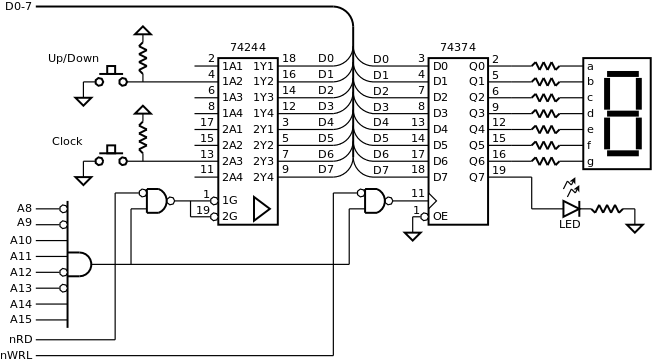

.. _Portos_exemplo4:

Contador
********

Neste exemplo, mostra-se como detetar transições em vários *bits* de um porto
de entrada, como manipular *bits* de um mesmo porto de saída, em diferentes contextos,
e como utilizar um *display* de sete segmentos.

No *display* apresenta-se um contador que evolui uma unidade por cada pressão no botão **Clock**.
O *display* é atualizado sempre que o valor do contador é alterado.
A pressão do botão **Up/Down** inverte o sentido de contagem -- crescente ou decrescente.
O sentido da contagem é indicado no LED: aceso -- contagem crescente;
apagado -- contagem decrescente.

   Porto de entrada com botões e porto de saída com *display* de sete segmentos

Na :numref:`counter_7segment` é apresentada uma solução de programação para a situação
enunciada.

A variável ``counter`` representa o contador, que evolui na gama de valores 0 a 9.

A variável `direction_state` representa o sentido de contagem do contador.
O seu valor é invertido em cada pressão do botão Up/Down
e é testado em cada pressão do botão Clock, para avançar o contador no sentido correto.

A variável `port_prev` representa o valor lido anteriormente do porto de entrada.
Ao ser comparada com o valor atual do porto de entrada permite
detetar alterações no estado dos botões.

Como um botão premido impõe o valor lógico 0 à entrada do porto,
o valor retornado por `inport_read` é imediatamente invertido
para que o código se escreva em lógica positiva, a assim facilitar a compreenção
(linhas 27 e 33).

.. literalinclude:: ../code/7segment.s
   :language: c
   :linenos:
   :caption: Programa de controlo do contador
   :name: counter_7segment
   :lines: 27-79

Depois da inicialização (linhas 25 a 30) o programa entra num ciclo infinito
cuja atividade é dividida em duas partes:
o processamento da indicação do sentido de contagem (linhas 34 a 37)
e o processamento do contador (linhas 38 a 50).

A primeira parte consiste na deteção de pressão do botão **Up/Down** (linha 34),
inversão da variável de estado ``direction_state`` (linha 35)
e afixação do sentido de contagem no LED (linha 36).

A segunda parte consiste na deteção de pressão do botão **Clock** (linha 38),
evolução do contador de acordo com a variável ``direction_state`` (linhas 39 a 48)
e afixação do valor do contador no *display* (linha 49).

A deteção da pressão do botão consiste em verificar se o estado anterior era 0 ::

   if ((port_prev & BUTTON_CLOCK_MASK) == 0

e se o estado atual é diferente de 0. ::

   (port_actual & BUTTON_CLOCK_MASK) != 0) {

A necessidade de manipular o *display*, ligado nos 7 *bits* de menor peso do porto,
e de manipular o LED, ligado no *bit* de maior peso do porto,
em contextos diferentes, levou é criação da função ``outport_write_bits``.

A utilização simples da função ``outport_write`` como definida na :numref:`outport_write_func_impar`
não é viável pois afeta todos os *bits* do porto -- ao atualizar o *display* modifica
o LED e vice-versa.

A função `'outport_write_bits`` -- :numref:`outport_write_bits` permite alterar apenas os *bits*
de algumas posições, mantendo o valor dos restantes.
Os *bits* que vão ser afetados são indicados através do parâmetro ``mask``
que contém o valor 1 nessas posições e 0 nas restantes. Por exemplo,
para especificar as posições afetas ao *display* a máscara é 0111 1111.

A manutenção dos restantes *bits* é baseada na memorização do valor anteriormente
escrito no porto, mantido na variável ``outport_image`` (linha 1) da :numref:`outport_write_bits`.

.. literalinclude:: ../code/7segment.s
   :language: c
   :linenos:
   :caption: Função ``outport_write_bits``
   :name: outport_write_bits
   :lines: 180-184

.. literalinclude:: ../code/7segment.s
   :language: asm
   :linenos:
   :caption: Função ``outport_write_bits`` em *assembly*
   :name: port_write_asm
   :lines: 186-201

A função  ``outport_write`` além de escrever o valor no porto de saída,
também atualiza a variável ``outport_image``.
 
.. literalinclude:: ../code/7segment.s
   :language: asm
   :linenos:
   :caption: Função ``outport_write``
   :name: outport_write_func_par
   :lines: 217-228

**Código fonte:** :download:`7segment.s<../code/7segment.s>`

**Teste em Logisim:**
   - Cicuito: :download:`p16_led_button.circ<../logisim/p16_7segment.circ>`
   - *Screenshot*: :download:`Screenshot_Logisim<../logisim/Screenshot_Logisim.png>`

   .. code-block:: console

      p16as 7segment.s -f logisim -l 2

**Teste no P16 Simulator:**
   - Ficheiro de configuração do p16sim: :download:`p16sim_config_ports_ex4.txt<../p16sim/p16sim_config_ports_ex4.txt>`
   - Compilação do programa:

   .. code-block:: console

      p16as 7segment.s

   - Invocação do simulador:

   .. code-block:: console

      p16sim -c p16sim_config_ports_ex4.txt

**Exercícios:**

1. Aumentar o porto de saída para 16 *bits*
   e acrescentar mais um *display* de sete segmentos,
   passando a ter capacidade para afixar dois dígitos decimais.
   Adaptar o programa de modo a atualizar os dois *displays* numa única instrução **str**.
