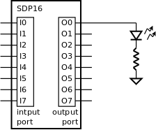

.. _Timers_exemplo1:

Pisca-pisca
***********

Neste exemplo mostra-se como realizar um pisca-pisca com um LED
ligado no porto de saída do SDP16 conforme a :numref:`sdp16_led`.

   Porto de saída do SDP16 com LED no *bit* 0

O programa da :numref:`pisca-pisca` executa indefinidamente em ciclos,
realizando em cada ciclo a seguinte sequência de ações: acender o LED
(linha 7); realizar uma temporização de meio período (linha 8);
apagar o LED (linha 9); repetir a temporização (linha 10).

A temporização consiste em impedir que o processamento prossiga
durante um certo tempo.
Assim, o LED vai permanecer acesso ou apagado durante o periodo que se segue.

.. literalinclude:: ../code/blink1.s
   :language: c
   :linenos:
   :caption: Programa para realizar o pisca-pisca
   :name: pisca-pisca
   :lines: 26-37

A temporização é realizada no interior da função ``timer_delay``.
São apresentadas duas soluções de implementação desta função:

.. toctree::
   :maxdepth: 2

   blink1.rst
   blink2.rst
