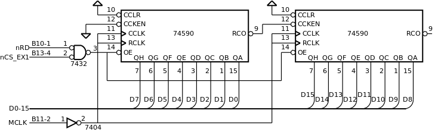

.. _Timers_exemplo12:

Temporização baseada em temporizador
************************************

O *hardware* destinado à medição de tempo designa-se por temporizador (*timer*).
O elemento essencial de um temporizador é um contador
que conta os ciclos produzidos por um oscilador (:numref:`timer_basic`).
Conhecendo a frequência do oscilador e o valor do contador,
determina-se o tempo que passou.

   Príncipio de funcionamento de um *timer*

Neste exemplo é realizado um *timer* elementar baseado em dois circuitos integrados
`74590 <https://www.ti.com/lit/ds/symlink/sn74hc590a.pdf?ts=1618508958868&ref_url=https%253A%252F%252Fwww.google.co.uk%252F>`_
que em conjunto formam um contador de 16 *bits* -- :numref:`sdp16_timer_74590`.
Este circuito integrado contém um contador e um registo com saída em *tri-state*.
A função de registo é anulada ao ligar RCLK a CCLK, a saída em *tri-state*,
controlada pelo sinal OE,
permite acoplamento direto ao processador como um porto de entrada.
Este conjunto, visto como um porto de entrada a 16 *bits*,
é acessível na gama de endereços entre 0xcc00 e 0xccff.

O contador evolui ao ritmo do relógio do processador -- sinal MCLK.
Admitindo uma frequência de 100Khz, uma unidade de contagem corresponde a 10 microsegundos.

O contador muda de estado nas transições descendentes do sinal de relógio,
enquanto o processador, ao realizar o ciclo de leitura,
capta os dados presentes no barramento de dados no final do sinal nRD,
coincidente com uma transição ascendente.
Se o contador evoluisse na mesma transição do sinal de relógio
em que o processador capta os dados do barramento de dados,
o contador seria lido num momento de instabilidade
e os dados lidos estariam errados.
O mesmo poderia acontecer se se utilizasse no contador,
um relógio assíncrono em relação ao relógio do processador.

   Timer elementar de 16 *bits* baseado em contadores 74590

Na :numref:`delay` apresenta-se a programação da função ``delay``.
Esta função retém o processamento pelo periodo de tempo definido pelo parâmetro ``time``.
A medição do tempo decorrido realiza-se subtraindo
o valor lido do contador no início do período (linha 2),
ao valor atual do contador (linha 3). Quando o resultado
desta subtração for igual ou superior a ``time``, o *while* termina e a função retorna.

Se o contador realizasse contagem decrescente, a subtração seria ao contrário.

Se o valor da leitura inicial for maior que o da leitura final,
é porque o contador atingiu o máximo e reiniciou nova contagem ("deu a volta").
Como a operação de subtração é realizada com o mesmo número de *bits* do contador,
gera empréstimo (*borrow*) e o resultado é o número de unidades que separa as duas parcelas,
ou seja, é o número de ciclos de relógio que ocorreram entre os dois momentos.

.. literalinclude:: ../code/blink2.s
   :language: c
   :linenos:
   :caption: Função ``delay`` baseada no *timer* da :numref:`sdp16_timer_74590`
   :name: delay
   :lines: 59-63

Ler o valor do contador do temporizador é como ler de um porto de entrada.
A função ``timer_read`` é implementada em *assembly* pelo código da :numref:`timer_read`.

.. literalinclude:: ../code/blink2.s
   :language: asm
   :linenos:
   :caption: Função ``timer_read``
   :name: timer_read
   :lines: 95-101

**Código completo:** :download:`blink2.s<../code/blink2.s>`

**Teste Logisim:**
   - Cicuito: :download:`sdp16_timer_counter.circ<../logisim/sdp16_timer_counter.circ>`
   - *Screenshot*: :download:`Screenshot_Logisim_counter<../logisim/Screenshot_Logisim_counter.png>`
   - Compilação:

   .. code-block:: console

      p16as blink2.s -f logisim -l 2

**Exercício:**

1. Testar este exemplo no SDP16.
