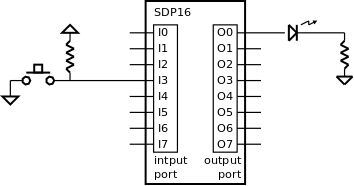

.. _Timers_exemplo2:

LED com temporização
********************

Neste exemplo realiza-se o controlo de um LED com temporização.
O utilizador prime um botão de pressão para acender ou apagar o LED:
se estiver aceso, apaga-se; se estiver apagado, acende-se
(funcionamento semelhante ao do exemplo da :numref:`Portos_exemplo3`).
Na altura de acender o LED, inicia-se também uma temporização.
Se o LED não for apagado por pressão do botão,
apagará automaticamente ao terminar a temporização.

O botão de pressão e o LED encontram-se ligados nos portos internos do SDP16,
conforma a :numref:`button_led`.

   Botão de pressão e LED ligados nos portos interno do SDP16

A referência temporal utilizada é baseada no *timer* da :numref:`sdp16_timer_74590`.

O programa da :numref:`lamp_delay` aplica um método de deteção de pressão do botão
idêntico ao do exemplo da :numref:`Portos_exemplo3`.
Os primeiros dois ciclos *while* (linhas 4 a 7),
servem para detetar a sequência soltar-premir o botão.
A esta deteção segue-se o acender o LED (linha 8).
Nesta altura regista-se o momento inicial da temporização (valor corrente do *timer*)
na variável ``time_initial`` (linha 9).
Nos *whiles* seguintes (linhas 10 a 14) realizam-se duas verificações em simultâneo:
a sequência soltar-premir o botão e o fim da temporização.
Aquilo que acontecer primeiro faz o
programa evoluir para uma nova iteração do *while* principal,
onde começa por se apagar o LED.
A função ``timer_elapsed`` recebe o valor do *timer* no momento inicial da temporização
e retorna o tempo que passou desde esse momento até agora.
Este valor é comparado com LED_TIME que representa
o tempo máximo que o LED deve ficar aceso.

.. code-block:: c
   :linenos:
   :caption: Programa de controlo do LED
   :name: lamp_delay

   int main() {
   	while (1) {
   		port_output(0)		/* apagar o LED */
   		while ((port_input() & BUTTON_MASK) == 0)
   			;
   		while ((port_input() & BUTTON_MASK) != 0)
   			;

   		port_output(LAMP_MASK);		/* acender o LED */
   		uint16_t time_initial = timer_read();

   		while ((port_input() & BUTTON_MASK) == 0
   			&& timer_elapsed(timer_initial) < LED_TIME)
   			;
   		while ((port_input() & BUTTON_MASK) != 0
   			&& timer_elapsed(timer_initial) < LED_TIME)
   	}
   }

A função ``timer_elapsed`` (:numref:`timer_elapsed`) retorna
a diferença entre o valor atual do contador do temporizador e o valor inicial.
Este valor representa o tempo que passou desde o momento inicial até agora.

.. code-block:: c
   :linenos:
   :caption: Função ``timer_elapsed``
   :name: timer_elapsed

   uint16_t timer_elapsed(uint16_t initial) {
   	return timer_read() - initial;
   }

**Código completo:** :download:`led_temp.s<../code/led_temp.s>`

**Logisim:**
   - Cicuito: :download:`sdp16_timer_counter.circ<../../example1/logisim/sdp16_timer_counter.circ>`

   - *Screenshot*: :download:`Screenshot_Logisim_counter<../../example1/logisim/Screenshot_Logisim_counter.png>`

   - Compilação:

   .. code-block:: console

      pas led_temp.s -f logisim -l 2

**Exercícios:**

1. Modificar a programação anterior de modo que uma pressão no botão,
enquanto o LED estiver aceso, provoca a reiniciação da contagem do tempo.
Esta modificação tem como consequência que o LED só se apaga por temporização
depois de decorrida uma temporização completa, sem que o botão tenha sido premido.
